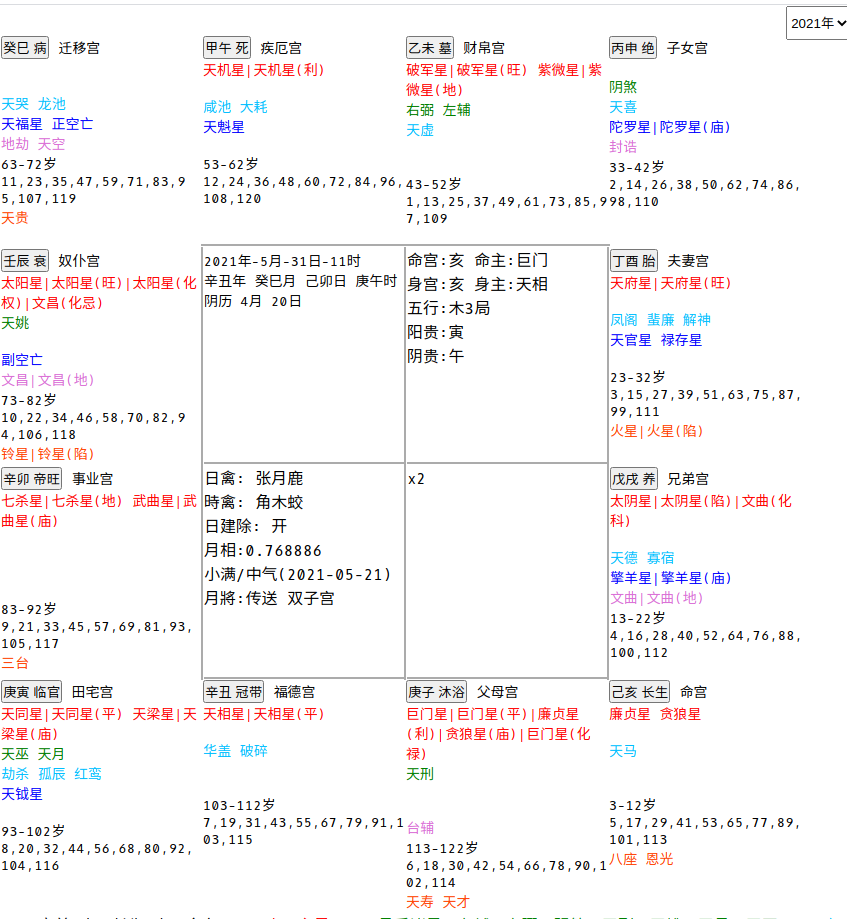

# zwds

### web
```text
l1: 寅首 十二长生 十二命宫
l2: 十四主星
l3: 月系诸星　左辅　右弼　阴煞　天刑　天姚　天月　天巫
l4: 年支系诸星　天喜	天虚	天哭	天德	红鸾	龙池	凤阁	孤辰	寡宿	破碎	大耗	华盖	解神	咸池	劫杀	天马	蜚廉
l5: 年干系诸星　"擎羊星","陀罗星","天钺星","天魁星","禄存星","天福星","天官星","正空亡","副空亡"
l6: 时系诸星　文昌　文曲　天空　地劫　台辅　封诰
l7: 大小限
l8: 其他星　火星 铃星 三台星 八座星 天贵星 恩光星 天才星 天寿星
```


### cli

./zwds-cli -i 2021051811男
```text
2021 5 18 11 男
辛丑年 癸巳月 阴历4月7日 甲午时
性别:男 命宫:亥 身宫:亥 五行局:木

亥宫:[己亥 命宫   太阴星 3-12岁 [5 17 29 41 53 65 77 89 101 113] 天马 火星]
子宫:[庚子 父母宫   贪狼星 113-122岁 [6 18 30 42 54 66 78 90 102 114] 天刑 八座]
丑宫:[辛丑 福德宫 天同星 巨门星 103-112岁 [7 19 31 43 55 67 79 91 103 115]]
寅宫:[庚寅 田宅宫 武曲星 天相星 93-102岁 [8 20 32 44 56 68 80 92 104 116] 三台 红鸾 天钺星]
卯宫:[辛卯 事业宫 太阳星 天梁星 83-92岁 [9 21 33 45 57 69 81 93 105 117]]
辰宫:[辛卯 事业宫 太阳星 天梁星 83-92岁 [9 21 33 45 57 69 81 93 105 117]]
巳宫:[癸巳 迁移宫 天机星   63-72岁 [11 23 35 47 59 71 83 95 107 119] 地劫 天空 天哭 龙池]
午宫:[甲午 疾厄宫 紫微星   53-62岁 [12 24 36 48 60 72 84 96 108 120] 天魁星]
未宫:[乙未 财帛宫   43-52岁 [1 13 25 37 49 61 73 85 97 109] 天虚 左辅星 右弼星]
申宫:[丙申 子女宫 破军星 33-42岁 [2 14 26 38 50 62 74 86 98 110] 天喜 陀羅星]
酉宫:[丁酉 夫妻宫 23-32岁 [3 15 27 39 51 63 75 87 99 111] 禄存星]
戌宫:[戊戌 兄弟宫 廉贞星 天府星 13-22岁 [4 16 28 40 52 64 76 88 100 112] 恩光 文曲星 羊刃星]

```
